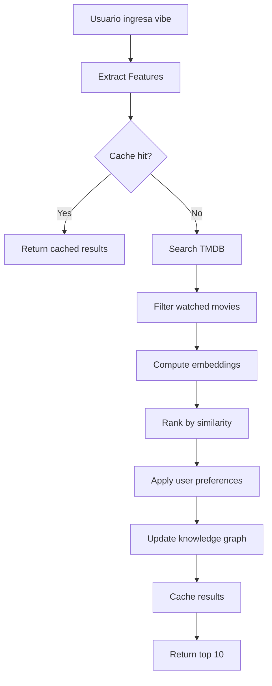

# Kuleshov Lab - Backend Architecture (Low-Cost Design)

## 🎯 Objetivo
Crear un backend inteligente para recomendaciones cinematográficas con **costos mínimos** (~$0-5/mes).

## 🏗️ Stack Tecnológico

### Core
- **Python 3.11+** - Lenguaje principal
- **FastAPI** - Framework web (rápido, moderno, async)
- **SQLite** - Base de datos relacional local (sin costos)
- **Neo4j Community Edition** - Knowledge graph (GRATIS, self-hosted)
  - Alternativa: Neo4j AuraDB Free (cloud, 200k nodes, 400k relationships)

### APIs Externas
- **TMDB API** - Datos de películas (GRATIS hasta 1M requests/mes)
- **Claude API (Anthropic)** - IA para análisis (uso limitado con caché)

### Optimización de Costos
- **Redis/Diskcache** - Caché local para reducir llamadas API
- **Sentence-Transformers** - Embeddings locales (sin OpenAI)
- **SQLite FTS5** - Búsqueda full-text sin Elasticsearch

## 📊 Arquitectura del Sistema

```
┌─────────────────────────────────────────────────────────────┐
│                        Frontend (React)                      │
│                     http://localhost:3000                    │
└────────────────────────┬────────────────────────────────────┘
                         │ REST API
                         ▼
┌─────────────────────────────────────────────────────────────┐
│                   FastAPI Backend (Python)                   │
│                     http://localhost:8000                    │
├─────────────────────────────────────────────────────────────┤
│  ┌──────────────┐  ┌──────────────┐  ┌──────────────┐      │
│  │   Routes     │  │  Services    │  │   Cache      │      │
│  │  /api/...    │→ │  - TMDB      │→ │  Diskcache   │      │
│  │              │  │  - Claude    │  │  (local)     │      │
│  └──────────────┘  │  - Recommend │  └──────────────┘      │
│                    └──────────────┘                          │
├─────────────────────────────────────────────────────────────┤
│  ┌──────────────┐  ┌──────────────┐  ┌──────────────┐      │
│  │   SQLite     │  │  Neo4j       │  │  Embeddings  │      │
│  │  - Users     │  │  Knowledge   │  │  Sentence-   │      │
│  │  - Movies    │  │  Graph       │  │  Transformers│      │
│  │  - Cache     │  │  (FREE)      │  │  (local)     │      │
│  └──────────────┘  └──────────────┘  └──────────────┘      │
└─────────────────────────────────────────────────────────────┘
                         │
                         ▼
              ┌──────────────────────┐
              │   External APIs      │
              │  - TMDB (free)       │
              │  - Claude (cached)   │
              └──────────────────────┘
```

## 🗄️ Esquema de Base de Datos (SQLite)

### Tabla: users
```sql
CREATE TABLE users (
    id INTEGER PRIMARY KEY AUTOINCREMENT,
    username TEXT UNIQUE NOT NULL,
    created_at TIMESTAMP DEFAULT CURRENT_TIMESTAMP,
    preferences_json TEXT,  -- JSON con preferencias
    embedding BLOB          -- Vector de gustos del usuario
);
```

### Tabla: movies
```sql
CREATE TABLE movies (
    id INTEGER PRIMARY KEY,           -- TMDB ID
    title TEXT NOT NULL,
    original_title TEXT,
    overview TEXT,
    release_date TEXT,
    genres TEXT,                      -- JSON array
    director TEXT,
    mood_tags TEXT,                   -- JSON: ["noir", "melancholic"]
    vibe_embedding BLOB,              -- Vector para búsqueda semántica
    tmdb_data TEXT,                   -- Cache completo de TMDB
    cached_at TIMESTAMP,
    UNIQUE(id)
);

CREATE VIRTUAL TABLE movies_fts USING fts5(
    title, overview, director, mood_tags,
    content=movies
);
```

### Tabla: user_movies
```sql
CREATE TABLE user_movies (
    id INTEGER PRIMARY KEY AUTOINCREMENT,
    user_id INTEGER NOT NULL,
    movie_id INTEGER NOT NULL,
    status TEXT CHECK(status IN ('watched', 'watchlist', 'liked', 'disliked')),
    rating REAL,                      -- 0-10
    watched_at TIMESTAMP,
    notes TEXT,
    FOREIGN KEY (user_id) REFERENCES users(id),
    FOREIGN KEY (movie_id) REFERENCES movies(id),
    UNIQUE(user_id, movie_id)
);
```

### Tabla: recommendations
```sql
CREATE TABLE recommendations (
    id INTEGER PRIMARY KEY AUTOINCREMENT,
    user_id INTEGER NOT NULL,
    movie_id INTEGER NOT NULL,
    score REAL NOT NULL,
    reason TEXT,                      -- Explicación de Claude
    created_at TIMESTAMP DEFAULT CURRENT_TIMESTAMP,
    shown BOOLEAN DEFAULT 0,
    FOREIGN KEY (user_id) REFERENCES users(id),
    FOREIGN KEY (movie_id) REFERENCES movies(id)
);
```

## 🧠 Knowledge Graph (Neo4j)

### ¿Por qué Neo4j?
- **Neo4j Community Edition**: Completamente GRATIS, self-hosted
- **Neo4j AuraDB Free**: Cloud gratuito (200k nodes, 400k relationships)
- Consultas Cypher nativas para grafos
- Algoritmos de grafos integrados (PageRank, Community Detection, etc.)
- Mejor rendimiento que NetworkX para grafos grandes

### Estructura del Grafo

```cypher
// Nodos
(:User {id, username, created_at, taste_vector})
(:Movie {id, title, overview, release_date, vibe_vector})
(:Genre {name})
(:Mood {name, intensity})
(:Director {name})
(:Actor {name})
(:Vibe {description, embedding})

// Relaciones (con propiedades)
(:User)-[:WATCHED {rating, date, notes}]->(:Movie)
(:User)-[:LIKES {strength}]->(:Genre)
(:User)-[:PREFERS {affinity}]->(:Mood)
(:User)-[:SIMILAR_TO {similarity}]->(:User)

(:Movie)-[:HAS_GENRE]->(:Genre)
(:Movie)-[:HAS_MOOD {intensity}]->(:Mood)
(:Movie)-[:DIRECTED_BY]->(:Director)
(:Movie)-[:STARS]->(:Actor)
(:Movie)-[:SIMILAR_TO {score}]->(:Movie)
(:Movie)-[:MATCHES_VIBE {score}]->(:Vibe)
```

### Consultas Cypher de Ejemplo

#### 1. Encontrar películas similares no vistas
```cypher
MATCH (u:User {id: $user_id})-[:WATCHED]->(watched:Movie)
MATCH (watched)-[:SIMILAR_TO]->(similar:Movie)
WHERE NOT (u)-[:WATCHED]->(similar)
RETURN similar, COUNT(*) as score
ORDER BY score DESC
LIMIT 10
```

#### 2. Recomendaciones basadas en géneros favoritos
```cypher
MATCH (u:User {id: $user_id})-[l:LIKES]->(g:Genre)
MATCH (g)<-[:HAS_GENRE]-(m:Movie)
WHERE NOT (u)-[:WATCHED]->(m)
RETURN m, SUM(l.strength) as score
ORDER BY score DESC
LIMIT 10
```

#### 3. Encontrar películas por vibe
```cypher
MATCH (v:Vibe {description: $vibe_description})
MATCH (v)<-[mv:MATCHES_VIBE]-(m:Movie)
MATCH (u:User {id: $user_id})
WHERE NOT (u)-[:WATCHED]->(m)
RETURN m, mv.score
ORDER BY mv.score DESC
LIMIT 10
```

#### 4. Usuarios con gustos similares (Collaborative Filtering)
```cypher
MATCH (u1:User {id: $user_id})-[:WATCHED]->(m:Movie)<-[:WATCHED]-(u2:User)
WHERE u1 <> u2
WITH u1, u2, COUNT(m) as common_movies
MATCH (u2)-[:WATCHED]->(rec:Movie)
WHERE NOT (u1)-[:WATCHED]->(rec)
RETURN rec, common_movies
ORDER BY common_movies DESC
LIMIT 10
```

### Algoritmos de Recomendación con Neo4j

1. **Collaborative Filtering**
   - Graph Data Science: Node Similarity
   - Encontrar usuarios con gustos similares

2. **Content-Based**
   - Embeddings + Cosine Similarity
   - Búsqueda por propiedades del grafo

3. **Graph-Based**
   - PageRank para películas populares en tu red
   - Community Detection para clusters de gustos
   - Shortest Path para descubrir conexiones

4. **Hybrid**
   - Combinar scores de múltiples algoritmos
   - Ponderación personalizada por usuario

## 🔌 API Endpoints

### Autenticación
```
POST   /api/auth/register
POST   /api/auth/login
GET    /api/auth/me
```

### Películas
```
GET    /api/movies/search?q={query}&vibe={vibe}
GET    /api/movies/{id}
GET    /api/movies/trending
POST   /api/movies/{id}/rate
```

### Recomendaciones
```
POST   /api/recommend/vibe
       Body: { "vibe": "neon-drenched 80s thriller", "filters": {...} }
       
GET    /api/recommend/feed?limit=10
       Returns: películas no vistas, ordenadas por score

POST   /api/recommend/analyze
       Body: { "movie_id": 123, "action": "like|dislike|watch" }
       Updates: knowledge graph y perfil de usuario
```

### Usuario
```
GET    /api/user/profile
GET    /api/user/watched
GET    /api/user/stats
POST   /api/user/preferences
```

## 💰 Estrategia de Optimización de Costos

### 1. Caché Agresivo
```python
# Caché de TMDB (30 días)
@cache(expire=2592000)
def get_movie_from_tmdb(movie_id):
    pass

# Caché de embeddings (permanente)
@cache(expire=None)
def get_movie_embedding(movie_id):
    pass

# Caché de respuestas Claude (7 días)
@cache(expire=604800)
def analyze_with_claude(prompt, context):
    pass
```

### 2. Batch Processing
- Procesar múltiples películas en una sola llamada a Claude
- Usar prompt caching de Claude (50% descuento)

### 3. Embeddings Locales
```python
from sentence_transformers import SentenceTransformer

# Modelo local (sin costos API)
model = SentenceTransformer('all-MiniLM-L6-v2')

def get_vibe_embedding(text: str):
    return model.encode(text)
```

### 4. Rate Limiting
```python
# Límites por usuario
- 100 búsquedas/día
- 50 recomendaciones/día
- 10 análisis con Claude/día
```

## 🎨 Sistema de "Vibe" Matching

### 1. Extracción de Vibe
```python
def extract_vibe_features(description: str) -> dict:
    """
    Input: "A neon-drenched 80s thriller"
    Output: {
        "era": "1980s",
        "visual_style": ["neon", "high-contrast"],
        "mood": ["tense", "stylized"],
        "genre_hints": ["thriller"],
        "color_palette": ["neon", "dark"],
        "atmosphere": "urban-nocturnal"
    }
    """
    # Usar Claude solo para vibes complejos
    # Usar regex/NLP local para vibes simples
```

### 2. Matching con Películas
```python
def find_movies_by_vibe(vibe: str, user_id: int, limit: int = 10):
    # 1. Extraer features del vibe
    vibe_features = extract_vibe_features(vibe)
    vibe_embedding = get_vibe_embedding(vibe)
    
    # 2. Buscar en SQLite con FTS5
    candidates = search_movies_fts(vibe_features)
    
    # 3. Filtrar películas ya vistas
    watched = get_user_watched_movies(user_id)
    candidates = [m for m in candidates if m.id not in watched]
    
    # 4. Ranking por similitud semántica
    scored = []
    for movie in candidates:
        similarity = cosine_similarity(
            vibe_embedding, 
            movie.vibe_embedding
        )
        scored.append((movie, similarity))
    
    # 5. Re-ranking con knowledge graph
    final_scores = rerank_with_graph(scored, user_id)
    
    return sorted(final_scores, reverse=True)[:limit]
```

## 🔄 Flujo de Recomendación

### Escenario: Usuario busca "melancholic rainy afternoon in Tokyo"



## 📦 Estructura del Proyecto

```
backend/
├── app/
│   ├── __init__.py
│   ├── main.py                 # FastAPI app
│   ├── config.py               # Settings
│   ├── database.py             # SQLite connection
│   ├── graph.py                # Neo4j connection
│   ├── models/
│   │   ├── user.py
│   │   ├── movie.py
│   │   └── recommendation.py
│   ├── services/
│   │   ├── tmdb.py            # TMDB API client
│   │   ├── claude.py          # Claude API client
│   │   ├── embeddings.py      # Local embeddings
│   │   ├── cache.py           # Cache manager
│   │   ├── neo4j_service.py   # Neo4j operations
│   │   └── recommender.py     # Recommendation engine
│   ├── routes/
│   │   ├── auth.py
│   │   ├── movies.py
│   │   ├── recommend.py
│   │   └── user.py
│   └── utils/
│       ├── vibe_parser.py     # Parse vibe descriptions
│       └── similarity.py      # Cosine similarity, etc.
├── data/
│   ├── kuleshov.db            # SQLite database (cache)
│   ├── cache/                 # Diskcache directory
│   └── models/                # Downloaded ML models
├── neo4j/                      # Neo4j data (si self-hosted)
│   ├── data/
│   ├── logs/
│   └── import/
├── scripts/
│   ├── init_neo4j.py          # Inicializar grafo
│   ├── seed_movies.py         # Poblar con películas
│   └── backup.py              # Backup del grafo
├── tests/
├── requirements.txt
├── docker-compose.yml          # Neo4j + FastAPI
├── .env.example
└── README.md
```

## 🚀 Estimación de Costos Mensuales

### Escenario: 1 usuario activo, 50 búsquedas/día

| Servicio | Uso | Costo |
|----------|-----|-------|
| TMDB API | 1,500 requests/mes | **$0** (gratis hasta 1M) |
| Claude API | ~150 requests/mes (cached) | **~$2-3** |
| Neo4j AuraDB Free | 200k nodes, 400k rels | **$0** (tier gratuito) |
| Neo4j Community | Self-hosted local | **$0** (open source) |
| SQLite | Local | **$0** |
| Embeddings | Local (Sentence-Transformers) | **$0** |
| Hosting | Local development | **$0** |
| **TOTAL** | | **$2-3/mes** |

### Opciones de Neo4j:

#### Opción 1: Neo4j AuraDB Free (Recomendado para empezar)
- ✅ Cloud-hosted (sin mantenimiento)
- ✅ 200,000 nodos
- ✅ 400,000 relaciones
- ✅ Suficiente para ~50k películas + usuarios
- ✅ Backups automáticos
- ❌ Límite de almacenamiento

#### Opción 2: Neo4j Community Edition (Self-hosted)
- ✅ Sin límites de datos
- ✅ Completamente gratis
- ✅ Control total
- ❌ Requiere mantenimiento
- ❌ Sin soporte oficial

### Optimizaciones adicionales:
- Usar Claude solo para análisis complejos
- Caché agresivo (90% hit rate)
- Batch processing
- Prompt caching de Claude (50% descuento)
- Neo4j: Índices en propiedades frecuentes
- Neo4j: Proyecciones de grafo en memoria para algoritmos

## 🔐 Variables de Entorno

```env
# .env
TMDB_API_KEY=your_tmdb_api_key
CLAUDE_API_KEY=your_claude_api_key

# SQLite (cache)
DATABASE_URL=sqlite:///./data/kuleshov.db
CACHE_DIR=./data/cache

# Neo4j (elegir una opción)
# Opción 1: AuraDB Free (cloud)
NEO4J_URI=neo4j+s://xxxxx.databases.neo4j.io
NEO4J_USER=neo4j
NEO4J_PASSWORD=your_password

# Opción 2: Local (self-hosted)
# NEO4J_URI=bolt://localhost:7687
# NEO4J_USER=neo4j
# NEO4J_PASSWORD=your_password

# Auth
SECRET_KEY=your_secret_key_for_jwt
ENVIRONMENT=development

# Rate Limiting
MAX_SEARCHES_PER_DAY=100
MAX_RECOMMENDATIONS_PER_DAY=50
MAX_CLAUDE_CALLS_PER_DAY=10
```

## 📝 Próximos Pasos

1. ✅ Configurar proyecto Python con FastAPI
2. ✅ Implementar cliente TMDB con caché
3. ✅ Crear esquema SQLite
4. ✅ Implementar embeddings locales
5. ✅ Desarrollar sistema de vibe parsing
6. ✅ Integrar Claude con rate limiting
7. ✅ Construir knowledge graph
8. ✅ Implementar endpoints API
9. ✅ Conectar con frontend
10. ✅ Testing y optimización

---

**Filosofía de diseño**: Máxima inteligencia, mínimo costo. Usar IA solo cuando sea necesario, cachear agresivamente, procesar localmente cuando sea posible.