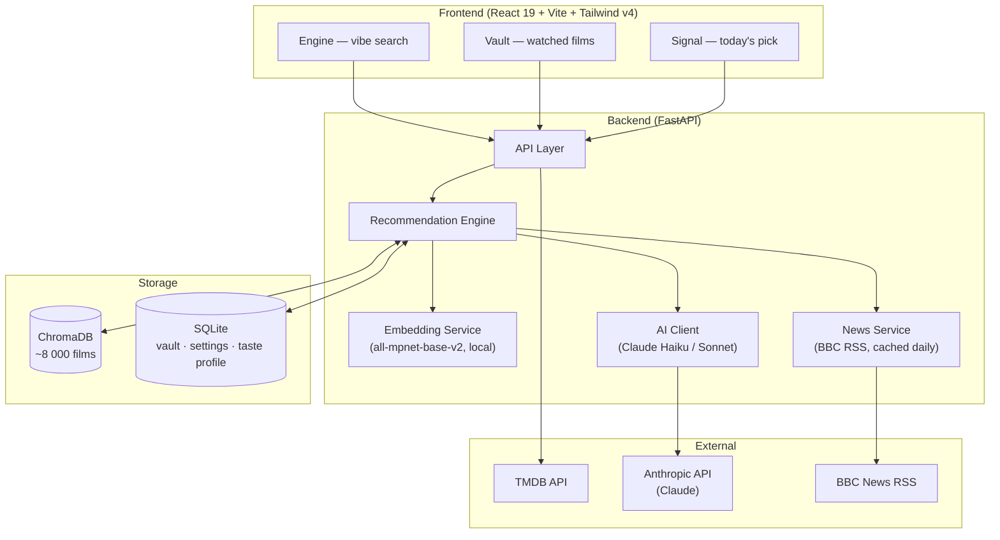
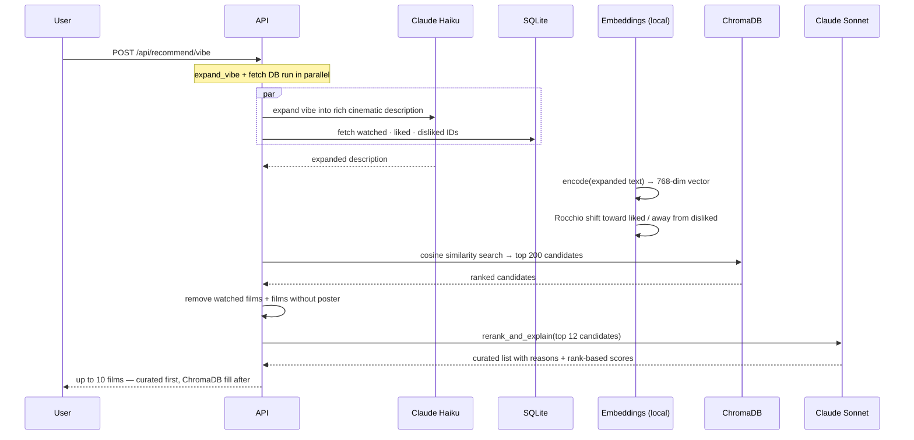
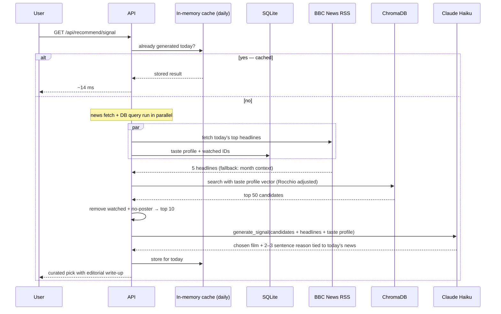

# Kuleshov Lab

<div align="center">
  <p>AI-powered cinematic curation platform</p>
  <p>Discover films through mood, atmosphere, and vibe — not just genres or ratings</p>
</div>

---

## Features

- **Engine** — describe a vibe in natural language and get a curated list of films that match the feeling, not just the genre
- **Vault** — your personal film archive; liked and disliked films continuously reshape future recommendations
- **Signal** — one film pick per day, chosen by AI based on your taste profile and today's news headlines

---

## Architecture



---

## How it works

### Engine — vibe search

Type anything: *"paranoid surveillance thriller, cold and fractured"* or *"melancholic rainy afternoon in Tokyo"*.



**Scoring:** the match percentage shown on each card comes from Claude's re-ranking, not raw vector similarity. Rank 1 → ~100%, rank 12 → ~60%. Films Claude didn't curate (shown after) keep their original ChromaDB cosine score (~75–82%) — it's normal for good matches to cluster in that range.

**Why two models?**
- Haiku (fast, cheap) expands the vibe query before embedding — a richer text produces better vector matches.
- Sonnet (smarter) re-ranks the top 12 candidates with cultural and contextual understanding, then writes the one-sentence reason for each film.

---

### Signal — today's pick

One film per day, curated from your vault and connected to what's happening in the world.



The Signal endpoint makes **one AI call** (Haiku). It does not expand or re-rank — the news context + taste profile are rich enough to guide the pick directly. If the news feed is unavailable, it falls back gracefully to a seasonal context.

---

### Vault — taste profile

Every liked or disliked film does two things:

1. **Rocchio adjustment** — the query vector in future searches shifts toward liked films and away from disliked ones. No AI needed; happens on every request.
2. **Taste profile rebuild** — after every 5 new liked/disliked films, Claude Sonnet writes a 3–4 sentence prose description of your cinematic sensibility. This profile is used by both the Engine re-ranker and the Signal to personalise picks. The rebuild happens in the **background** after `mark_watched`, so it never adds latency to recommendations.

---

## Stack

| Layer | Technology |
|---|---|
| Frontend | React 19 · TypeScript · Vite · Tailwind CSS v4 · Framer Motion |
| Backend | FastAPI · Python 3.12 |
| Vector store | ChromaDB (persistent, HNSW cosine) |
| Embeddings | Sentence-Transformers `all-mpnet-base-v2` (local, no API cost) |
| User data | SQLite via aiosqlite |
| Movie metadata | TMDB API |
| AI re-ranking | Any litellm-supported model — default: Claude Sonnet (optional) |
| Vibe expansion | Any litellm-supported model — default: Claude Haiku (optional) |
| News headlines | BBC News RSS (no API key needed) |

The app works fully without an AI API key — vibe expansion falls back to a local keyword-expansion dictionary, and results are returned in raw ChromaDB order without reasons.

---

## Setup

### Requirements

- Python 3.11+
- Node.js 18+
- [TMDB API key](https://www.themoviedb.org/settings/api) (free)
- AI API key (optional — enables re-ranking, Signal write-ups, and taste profiles)

### 1. Backend

```bash
cd backend
pip install -r requirements.txt
cp .env.example .env
```

Edit `.env`:

```env
TMDB_API_KEY=your_tmdb_key
AI_API_KEY=your_ai_api_key   # optional
```

### 2. Populate the vector store

Index movies from TMDB into ChromaDB. Only needed the first time (or when you want to expand the catalogue):

```bash
cd backend
python ingest_movies.py                  # ~1 600 movies, a few minutes
python ingest_movies.py --pages 100      # ~8 000 movies
python ingest_movies.py --skip-existing  # add new pages without re-indexing
```

> On the very first run, Sentence-Transformers downloads `all-mpnet-base-v2` (~500 MB). This only happens once — subsequent runs use the cached model.

### 3. Frontend

```bash
cd frontend
npm install
```

### 4. Run

```bash
# Terminal 1
cd backend && uvicorn app.main:app --reload --port 8000

# Terminal 2
cd frontend && npm run dev
```

- Frontend: [http://localhost:3000](http://localhost:3000)
- API docs: [http://localhost:8000/docs](http://localhost:8000/docs)

---

## License

See [LICENSE](LICENSE).

---

<div align="center">
  <i>"In the cinema, the combination of shots is the essence of the art."</i><br>
  — Lev Kuleshov
</div>
